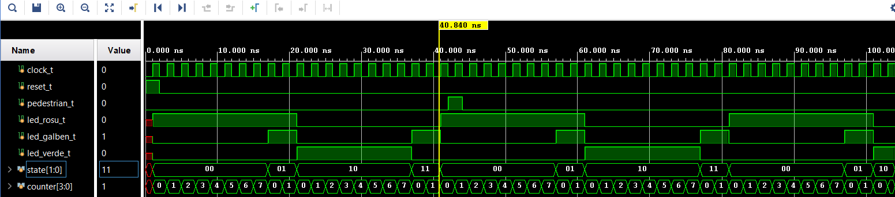

# Traffic Light FSM in SystemVerilog

Automat finit pentru un semafor cu buton de pieton. Proiect din cadrul Circuite Integrate Digitale (ETTI UPB), lab 11 - Automate finite.

## Stari

| Stare | Cod | Durata (cicluri clock) |
|---|---|---|
| ROSU | `00` | 8 |
| ROSU + GALBEN | `01` | 2 |
| VERDE | `10` | 8 |
| GALBEN | `11` | 2 |

Cand pedestrian == 1 in starea VERDE, semaforul trece imediat la GALBEN (apoi la ROSU).

## Iesiri

- `led_rosu` = 1 in starile ROSU si ROSU_GALBEN
- `led_galben` = 1 in starile ROSU_GALBEN si GALBEN
- `led_verde` = 1 in starea VERDE

## Module

| Fisier | Rol |
|---|---|
| `src/traffic_light.sv` | Modulul FSM |
| `sim/traffic_light_tb.sv` | Testbench |

## Simulare in Vivado

1. Create New Project -> RTL Project
2. Add Sources -> `src/traffic_light.sv`
3. Add Sources -> simulation sources -> `sim/traffic_light_tb.sv`
4. Set `traffic_light_TB` ca top de simulare
5. Run Simulation -> Run Behavioral Simulation
6. Verifica `state`, `counter`, `led_rosu`, `led_galben`, `led_verde` in waveform

## Waveform

Tranzitiile FSM: `00` (ROSU) -> `01` (ROSU+GALBEN) -> `10` (VERDE) -> `11` (GALBEN) -> `00`. La 40ns, `pedestrian_t` devine 1 in starea VERDE si forteaza tranzitia imediata la GALBEN.
